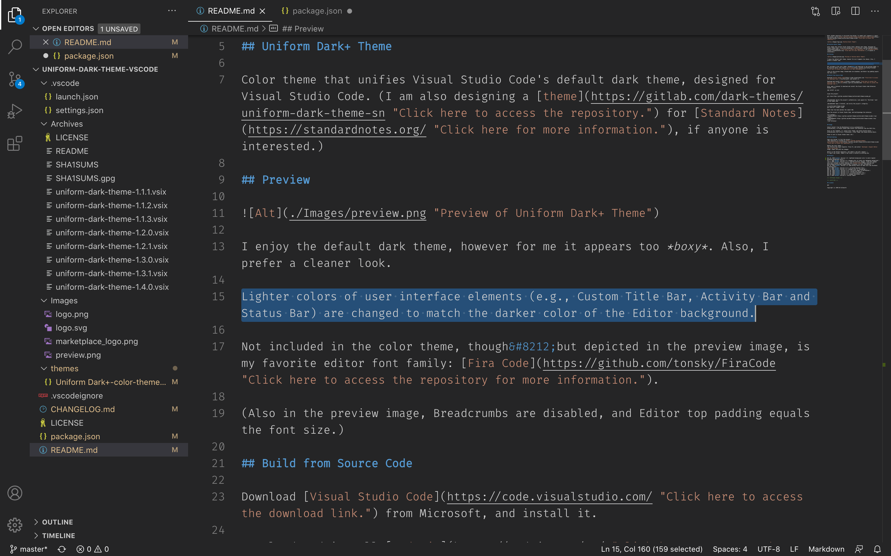

Note: GitHub repository is mirrored from GitLab. To submit pull requests or report any issues, go to [https://gitlab.com/saegl5/uniform-dark-theme](https://gitlab.com/saegl5/uniform-dark-theme "Click here to access the repository.").

## Uniform Dark+ Theme

Color theme that unifies Visual Studio Code's default dark theme.

## Preview

I enjoy the default dark theme, however for me it appears too *boxy*. Also, I prefer a cleaner look.

Lighter colors of user interface elements (e.g., Custom Title Bar, Activity Bar and Status Bar) are changed to match the darker color of the Editor background.

Not included in the color theme, though&#8212;but depicted in the preview image, is my favorite editor font family: [Fira Code](https://github.com/tonsky/FiraCode "Click here to access the repository for more information.").

## Build from Source Code

Download [Visual Studio Code](https://code.visualstudio.com/ "Click here to access the download link.") from Microsoft, and install it.

Download and install [Node.js](https://nodejs.org/en/ "Click here to access the download link.") and [Git](https://git-scm.com/downloads "Click here to access the download link.").

Also, open a terminal to download and install the Visual Studio Code Extension Manager (vsce):
<pre>
npm install -g vsce
</pre>

Clone the project:
<pre>
git clone https://gitlab.com/saegl5/uniform-dark-theme.git
</pre>

(Recommended) Verify the project's authenticity: Look upward for "Verified," next to the commit SHA.

(Recommended) Open a terminal, and verify the project's integrity:
<pre>
cd uniform-dark-theme
git show-ref --heads --hash
</pre>
Check that the hash matches the commit SHA.

Open the project in Visual Studio Code, and build/package the extension:
<pre>
vsce package \
--baseContentUrl https://raw.githubusercontent.com/saegl5/uniform-dark-theme/master/ \
--baseImagesUrl https://raw.githubusercontent.com/saegl5/uniform-dark-theme/master/
</pre>

(The GitLab repository is mirrored to GitHub. Otherwise, the logo and preview image will not load in the Visual Studio Code Marketplace extension overview.)

## Usage

Select Install to do so automatically. 
Alternatively, install the extension from the VSIX file in Visual Studio Code.

Press on the cogwheel, ⚙️; select Color Theme; and choose Uniform Dark+. 
Alternatively, go to File > Preferences > Color Theme, and choose Uniform Dark+.

Known to work in Visual Studio Code 1.44.2

## Contributing

Sign into GitLab, to fork the project. 
(The repository is located at [https://gitlab.com/saegl5/uniform-dark-theme](https://gitlab.com/saegl5/uniform-dark-theme "Click here to access the repository.").)

Modify the color theme. 
Stage, commit and push the changes.

Return to the GitLab repository, and submit a new pull request. 
To report any issues, submit a new issue or discuss an existing one.

## History

Apr 16, 2020 &middot; Version 1.1.3: corrected images in marketplace 
Apr 16, 2020 &middot; Version 1.1.2: refined the project 
Apr 11, 2020 &middot; Version 1.1.1: corrected manifest file 
Apr 10, 2020 &middot; Version 1.1: changed tab border color 
Apr 9, 2020 &middot; Version 1: initial commit

<!-- ## Known Issues -->

## License

MIT

Copyright (c) 2020 Ed Silkworth